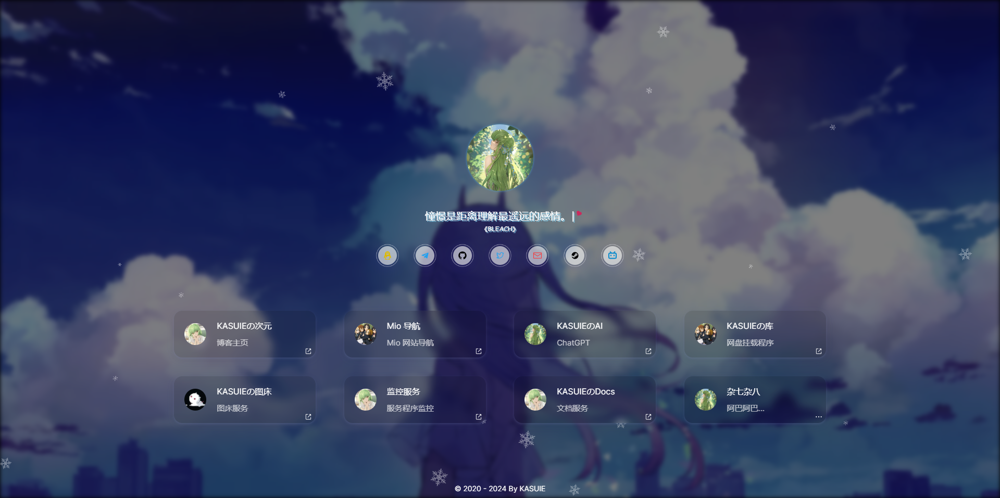
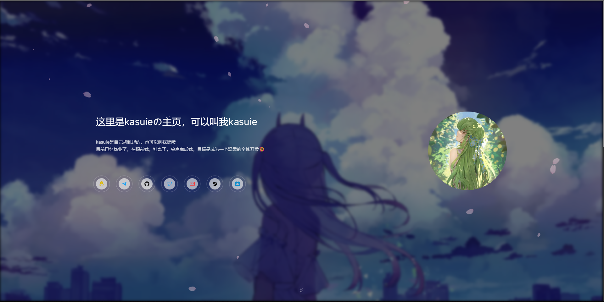

# 个人主页

remio-home(homepage): 基于配置的个人主页

- Next.js构建，服务端渲染，较好的SEO
- 部署方便，支持docker，vercel快速部署
- 配置方便，支持在线配置，文件配置
- Pwa 支持，也可进行配置
- 移动端适配...

预览：

>  

[演示 Demo (国内)](https://home.kasuie.cc) [演示 Demo (国外)](https://home.remio.cc) [演示 Demo (Vercel)](https://index.remio.cc)

## 部署

### 容器部署

1. 拉取镜像

```sh
docker pull kasuie/remio-home

# 如果因为网络原因拉取不到，可考虑阿里云镜像，运行下面这个

docker pull registry.cn-shanghai.aliyuncs.com/remio/remio-home
```

2. 启动容器

> 注意：启动容器需要根据自己需要，配置有所不同，请自行选择

- 创建项目目录，存放环境变量和配置文件

```
# 创建目录并进入该目录
mkdir remio-home && cd remio-home
```

- docker 启动

启动前需要创建一个存放环境变量的文件，包括站点统计和站点密码，避免下次部署的时候忘记了

```
# 创建文件
touch .env

# 然后编辑环境变量，vim操作可以自行搜一下
vim .env

# 根据需要按需在文件内填写环境变量，一行一个，不要后面注释
GTMID=value #Google Tag Manager
GTAGID=value #Google Analytics
BAIDUID=value #百度统计
PASSWORD=your_password #密码，用于在线访问和编辑配置
BaiduSiteVerify=xxxx #百度站点验证
AMAP_KEY=xxxx #高德地图key

```

> `GTAGID`为[Google Analytics](https://analytics.google.com)处获取的id，`GTMID`为[Google Tag Manager](https://tagmanager.google.com)处获取的id，`BAIDUID`为[百度统计](https://tongji.baidu.com)处获取的id，如果用`GTMID` 不必再用其它两个了，根据自己需要来。

编写环境变量文件后，然后运行：

```sh
# 这里映射的宿主机端口为 3004，可自行修改，部署完成后 ip 加端口就可以访问了，然后-v 后面是挂载了三个目录，一个是配置文件的存放目录，一个是 icon 的存放目录，用于自定义 pwa 图标的，一个是 font 字体存放的存放目录，挂载后自动会创建目录
docker run --name remio-home -p 3004:3000 --env-file ./.env -v ./config:/remio-home/config -v ./icons:/remio-home/public/icons -v ./fonts:/remio-home/public/fonts -d kasuie/remio-home

# 如果你是用的阿里云镜像，则运行下面这个
docker run --name remio-home -p 3004:3000 --env-file ./.env -v ./config:/remio-home/config -v ./icons:/remio-home/public/icons -v ./fonts:/remio-home/public/fonts -d registry.cn-shanghai.aliyuncs.com/remio/remio-home
```

> 注意挂载目录不要直接挂载到`/remio-home/public`，这样会覆盖原有的文件，所以挂载其下面的目录，成功后，可以通过自己在线地址+目录名访问目录中的文件，如果需要自定义字体，填相对路径就好

运行成功之后，如果现在ip+端口打开页面，可以看到是默认配置的效果。

- 自定义

在当前目录下，刷新一下，应该会有一个你挂载的配置目录（`/config`），修改一下该目录的权限为`777`,这样才能进行在线配置修改：`sudo chmod  -R 777 ./config`.

然后进入该目录新建`config.json`文件，就可以在线编辑了，在线上地址后面加上`/config`进行访问，首次输入刚刚环境变量设置的密码验证通过后可以进行查看编辑配置。

当然你也可以在服务器上编辑`config.json`文件里，直接填写你站点的配置信息。

可参考仓库里 `/src/config/config.json` 进行修改，下方有参数说明可进行查看。

- pwa支持及自定义图标

需要你在挂载目录`/usr/local/icons`至少上传一张命名为 `favicon192.png` 的图片，不然`pwa`不会生效。另外为了还应包含`favicon64.png `,`favicon128.png`和`favicon512.png`，这三种不是必须，但是不上传控制台会有报错，后续看情况可能会调整所需尺寸的张数。

以上配置（除了首次上传`favicon192.png`）修改后不需要重启项目，在页面刷新一下就能看到效果了。

> 首次上传`favicon192.png`的时候可能会出现，pwa没有生效，可能需要重启一下容器，运行`docker-compose restart`。

- docker compose 启动

在刚刚新建的目录下，再创建一个配置文件`docker-compose.yml`，内容如下：

```yml
version: "3"

services:
  remio-home:
    image: kasuie/remio-home # 阿里云用这个：registry.cn-shanghai.aliyuncs.com/remio/remio-home
    container_name: remio-home
    ports:
      - "3004:3000"
    environment:
      - GTMID=value # Google Tag Manager
      - GTAGID=value # Google Analytics
      - BAIDUID=value # 百度统计
      - PASSWORD=your password # 密码，用于在线访问和编辑配置
      - BaiduSiteVerify=verifycode #百度站点验证
      - AMAP_KEY=xxxx #高德地图key
    volumes:
      - ./config:/remio-home/config
      - ./icons:/remio-home/public/icons
      - ./fonts:/remio-home/public/fonts
    restart: unless-stopped
```

然后运行命令启动：

```sh
docker-compose up -d remio-home
```

配置也和docker启动一样，注意替换变量

### 部署到Vercel

> ~注意，在线编辑仅支持`docker`部署，vercel部署没办法持久化配置文件，所以每一次重新部署，都会重置配置~。
>
> **新增功能：** 从 `v1.0.6` 版本开始，vercel部署如果配置了数据库，也支持在线编辑，数据库仅支持`PostgreSQL`，在vercel可以免费创建配置数据库，然后在项目环境变量处设置数据量连接的环境变量`PG_DATABASE_URL`，格式为`postgres://xxxxxx`，如果连接失败，可以去掉连接url的`?`后面的参数。

[](https://vercel.com/new/clone?repository-url=https://github.com/kasuie/remio-home&env=PASSWORD&project-name=remio-home&repository-name=remio-home)

点击上方按钮即可，填写必要的环境变量，点击创建完成后，回到自己创建的仓库里，按需修改 `/src/config/config.json` 文件即可。

自定义pwa图标和字体，在`/public`目录下，上传`/public/icons`覆盖已有的图标，字体上传到`/public/fonts`，相对路径`/fonts/xxx.ttf`就是你上传的字体文件，在配置字体资源路径的地方填写就好了。

以下是一些参数说明：

| 字段           | 类型                                          | 必填 | 说明                                                                          |
| -------------- | --------------------------------------------- | ---- | ----------------------------------------------------------------------------- |
| name           | string                                        | 是   | 站点标题                                                                      |
| favicon        | string                                        | 否   | 站点图标                                                                      |
| domain         | string                                        | 否   | 站点链接                                                                      |
| keywords       | string                                        | 否   | 站点关键词（SEO用）                                                           |
| description    | string                                        | 否   | 站点描述性信息（SEO用）                                                       |
| avatarConfig   | [AvatarConfig](#AvatarConfig-类型说明)        | 否   | 主页头像相关配置                                                              |
| layoutConfig   | [LayoutConfig](#LayoutConfig-类型说明)        | 否   | 布局相关的一些配置                                                            |
| globalStyle    | [GlobalStyle](#GlobalStyle-类型说明)          | 否   | 全局样式相关的一些配置，如字体，主题                                          |
| bgConfig       | [BgConfig](#BgConfig-类型说明)                | 否   | 背景相关的一些配置                                                            |
| subTitle       | string                                        | 否   | 站点头像下的次标题。可填入一言API，例如：`https://v1.hitokoto.cn?c=a&c=b&c=c` |
| footer         | string/[FooterConfig](#FooterConfig-类型说明) | 否   | 底部设置项                                                                    |
| links          | [Link[]](#link-类型说明)                      | 是   | 社交媒体的链接                                                                |
| sites          | [Site[]](#site-类型说明)                      | 是   | 项目或者其他站点链接                                                          |
| sitesConfig    | [SitesConfig](#SitesConfig-类型说明)          | 否   | sites 渲染组件配置项                                                          |
| subTitleConfig | [SubTitleConfig](#SubTitleConfig-类型说明)    | 否   | 次标题渲染组件配置项                                                          |
| socialConfig   | [SocialConfig](#SocialConfig-类型说明)        | 否   | 社交媒体的链接渲染组件配置项                                                  |
| sliders        | [SlidersConfig](#SlidersConfig-类型说明)      | 否   | 技能加点组件配置项                                                            |
| resources      | [Resources](#Resources-类型说明)              | 否   | 加在第三方资源及添加一些自定义body                                            |

#### AvatarConfig 类型说明

| 字段         | 类型    | 必填 | 说明                                                                |
| ------------ | ------- | ---- | ------------------------------------------------------------------- |
| hidden       | boolean | 否   | 是否隐藏该组件，默认`false`                                         |
| src          | string  | 否   | 头像资源路径                                                        |
| size         | number  | 否   | 头像尺寸                                                            |
| round        | string  | 否   | 圆角程度，可选`full`,`3xl`,`xl`,`sm`,`md`和`lg`，默认`full`         |
| hoverAnimate | string  | 否   | 头像`hover` 时效果动画，可选`top` 和 `rotate`，默认为空没有动画     |
| style        | string  | 否   | 头像效果动画，可选`glint` 和 `wave`，默认为空没有动画               |
| aloneRight   | boolean | 否   | 头像单独在右侧，`layoutConfig.style`为`horizontal`生效，默认`false` |

#### BgConfig 类型说明

| 字段            | 类型            | 必填 | 说明                                                                                                   |
| --------------- | --------------- | ---- | ------------------------------------------------------------------------------------------------------ |
| bg              | string/string[] | 否   | pc背景资源链接                                                                                         |
| mbg             | string/string[] | 否   | 移动端背景资源链                                                                                       |
| audio           | string          | 否   | 背景音乐                                                                                               |
| bgStyle         | string          | 否   | 背景飘浮风格。可选值：`sakura`(樱花) 或 `snow`：(雪花)，也可自行填写飘浮物资源图片                     |
| blur            | string          | 否   | 背景模糊程度，可选`none`,`sm`,`md`和`lg`，默认`sm`                                                     |
| cardOpacity     | number          | 否   | 卡片的透明度，`0-1`之间，默认`0.1`                                                                     |
| carousel        | boolean         | 否   | 开启图片轮播，背景图片数大于1生效，默认`true`                                                          |
| carouselGap     | number          | 否   | 图片轮播间隔时间，单位s(秒)，默认`5s`，最小`3s`                                                        |
| transitionTime  | number          | 否   | 图片轮播过渡时间，单位s(秒)，默认`0.7s`                                                                |
| transitionStyle | string          | 否   | 图片轮播过渡动画，可选`default`,`toBottom`,`toTop`,`toIn`,`toInOut`,`toRight`和`toLeft`，默认`default` |
| autoAnimate     | boolean         | 否   | 背景图动画，默认`false`不开启                                                                          |

#### LayoutConfig 类型说明

| 字段          | 类型    | 必填 | 说明                                                  |
| ------------- | ------- | ---- | ----------------------------------------------------- |
| istTransition | boolean | 否   | 是否开启渲染过渡动画，默认开启                        |
| gapSize       | string  | 否   | 布局，可选`sm`,`md`和`lg`，默认`sm`                   |
| style         | string  | 否   | 布局风格，可选`horizontal`,`vertical`，默认`vertical` |

#### GlobalStyle 类型说明

| 字段         | 类型                             | 必填 | 说明                                                                                               |
| ------------ | -------------------------------- | ---- | -------------------------------------------------------------------------------------------------- |
| fonts        | [FontItem[]](#FontItem-类型说明) | 否   | 自定义字体数组                                                                                     |
| fallback     | string                           | 否   | 次要字体，优先级低于自定义字体，做字体垫片                                                         |
| primaryColor | string                           | 否   | 主题色，十六进制颜色值，默认`#229fff`（蓝色），~没啥大用的样子~                                    |
| theme        | string                           | 否   | 主题设置，可选：`dark`,`light`,`switcher`。`switcher`为开启切换按钮，其他的为固定主题，默认`light` |
| weather      | boolean                          | 否   | 是否显示地理天气，默认`false`不显示                                                                |

#### FontItem 类型说明

| 字段 | 类型   | 必填 | 说明                       |
| ---- | ------ | ---- | -------------------------- |
| src  | string | 否   | 字体文件资源链接           |
| name | string | 否   | 给该字体取个名称，最好英文 |

#### FooterConfig 类型说明

| 字段       | 类型    | 必填 | 说明                                                               |
| ---------- | ------- | ---- | ------------------------------------------------------------------ |
| text       | string  | 否   | 展示文字                                                           |
| url        | string  | 否   | 展示文字的链接地址，点击可跳转                                     |
| ICP        | string  | 否   | 备案号，填写后会链接到工信部                                       |
| MPSICP     | string  | 否   | 公安部备案号，填写后会链接到公安部                                 |
| direction  | string  | 否   | 排列方式，可选`col`,`row`，`col-reverse`和`row-reverse`，默认`col` |
| isExternal | boolean | 否   | 是否展示链接图标，默认`false`                                      |

#### Link 类型说明

| 字段  | 类型   | 必填 | 说明     |
| ----- | ------ | ---- | -------- |
| title | string | 是   | 标题     |
| color | string | 否   | 颜色     |
| url   | string | 是   | 链接     |
| icon  | string | 否   | 图标链接 |

#### Site 类型说明

| 字段  | 类型   | 必填 | 说明                                                              |
| ----- | ------ | ---- | ----------------------------------------------------------------- |
| icon  | string | 是   | 图标链接                                                          |
| title | string | 是   | 标题                                                              |
| url   | string | 否   | 链接，`url` 为空，该元素在数组中后面的元素都会展示在弹框`modal`中 |
| desc  | string | 否   | 描述                                                              |

#### SubTitleConfig 类型说明

| 字段         | 类型           | 必填 | 说明                                                                                         |
| ------------ | -------------- | ---- | -------------------------------------------------------------------------------------------- |
| heart        | boolean        | 否   | 是否显示右上角爱心图标，默认：`true`                                                         |
| typing       | boolean        | 否   | 是否开启打字效果，默认：`false`                                                              |
| loading      | string/boolean | 否   | 出现动画效果，可选`wave`，默认为空没有动画                                                   |
| loopTyping   | boolean        | 否   | 是否支持切换一言，`typing`为`true`生效，默认：`false`                                        |
| shadow       | boolean        | 否   | 是否显示文字阴影效果，默认：`false`                                                          |
| typingGap    | number         | 否   | 一言间隔多久开始清除，单位秒(s)，默认为10s，最小3s                                           |
| typingCursor | boolean        | 否   | 是否展示打字光标，`typing`为`true`生效，默认：`true`                                         |
| showFrom     | boolean        | 否   | 是否显示一言来源，默认：`true`                                                               |
| style        | string         | 否   | `layoutConfig.style` 为 `horizontal` 生效，样式风格，可选，`desc`,`default`，默认：`default` |
| desc         | string         | 否   | `subTitleConfig.style` 为 `desc` 生效，描述，如果需要分行展示以`;`分隔，下同                 |
| content      | string         | 否   | `subTitleConfig.style` 为 `desc` 生效，详细描述内容                                          |
| gapDelay     | number         | 否   | 文字出现间隔，单位秒，默认`0.05`秒                                                           |

#### SocialConfig 类型说明

| 字段    | 类型           | 必填 | 说明                                       |
| ------- | -------------- | ---- | ------------------------------------------ |
| ripple  | boolean        | 否   | 是否开启涟漪动画，默认：`true`             |
| loading | string/boolean | 否   | 出现动画效果，可选`wave`，默认为空没有动画 |

#### SlidersConfig 类型说明

| 字段   | 类型                         | 必填 | 说明                             |
| ------ | ---------------------------- | ---- | -------------------------------- |
| data   | [Slider[]](#Slider-类型说明) | 否   | 数据数组                         |
| title  | string                       | 否   | 标题，为空不展示                 |
| hidden | boolean                      | 否   | 是否隐藏该组件                   |
| color  | string                       | 否   | 进度条自定义颜色，默认白色`#fff` |
| column | number                       | 否   | 一行展示几列，2-4的范围，默认`2` |

#### Slider 类型说明

| 字段  | 类型   | 必填 | 说明                    |
| ----- | ------ | ---- | ----------------------- |
| title | string | 否   | 标题                    |
| color | string | 否   | 颜色                    |
| value | number | 否   | 技能掌握程度，0-100之间 |
| icon  | string | 否   | 图标链接                |

#### 关于icon

目前内置有图标：

```js
    github, twitter, qq, telegram, email, steam, bilibili, discord, instargram, x,
```

`icon` 字段填写图标名即可使用，如果没有你需要的，也可以填写图标的资源链接使用

#### SitesConfig 类型说明

| 字段       | 类型    | 必填 | 说明                                                                   |
| ---------- | ------- | ---- | ---------------------------------------------------------------------- |
| cardStyle  | string  | 否   | 站点卡片风格，可选`default`,`flip`                                     |
| hoverBlur  | boolean | 否   | hover状态下是否模糊                                                    |
| hoverScale | boolean | 否   | hover状态下是否调整比例                                                |
| hoverFlip  | boolean | 否   | 卡片是否可翻转，默认`true`，`cardStyle`为`flip`生效                    |
| direction  | string  | 否   | 卡片内容排列方式，可选`col`和`row`，默认`col`，`cardStyle`为`flip`生效 |
| modal      | boolean | 否   | 是否显示`modal`                                                        |
| modalTips  | string  | 否   | `modal`的提示语                                                        |
| modalTitle | string  | 否   | `modal`的标题                                                          |

#### Resources 类型说明

| 字段     | 类型     | 必填 | 说明                       |
| -------- | -------- | ---- | -------------------------- |
| css      | string[] | 否   | 引入外部css                |
| js       | string[] | 否   | 引入外部js                 |
| bodyHtml | string   | 否   | 自定义添加一些body内的html |

### 本地启动

安装依赖

```js
pnpm install // 需要先安装pnpm: https://pnpm.io/
```

本地启动

```js
pnpm dev
```

打包

```js
pnpm build
```

## 补充

在你部署后，在配置页面输入密码后，可在部署域名后面加上`/api/config`查看目前的配置信息
