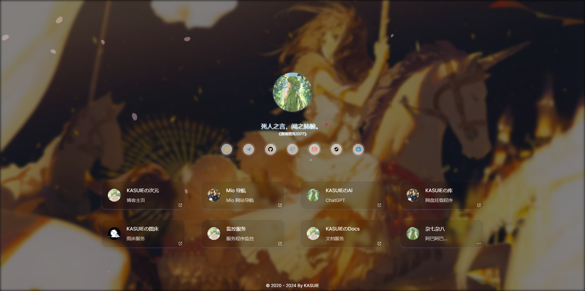

<!--
 * @Author: kasuie
 * @Date: 2024-05-20 19:31:13
 * @LastEditors: kasuie
 * @LastEditTime: 2024-06-19 16:52:24
 * @Description:
-->

# 个人主页

remio-home(homepage): 基于配置的个人主页

- Next.js构建，服务端渲染，较好的SEO
- 部署方便，支持docker，vercel快速部署
- 配置方便，修改一个文件基本就可完成
- Pwa 支持，也可进行配置
- 移动端适配...

预览：

>  > 

[演示 Demo](https://remio-home.vercel.app)

## 部署

### 容器部署

拉取镜像

```sh
docker pull kasuie/remio-home
```

如果你因为网络原因拉取不到，可考虑阿里云镜像：

```sh
docker pull registry.cn-shanghai.aliyuncs.com/remio/remio-home
```

**注意：启动容器需要根据自己需要，有所不同，请自行选择**

**按默认启动容器**

```sh
docker run --name remio-home -p 3000:3000 -v /usr/local/config:/remio-home/config -d kasuie/remio-home:latest
```

**需要支持统计分析，需要指定环境变量**

```sh
docker run --name remio-home -p 3000:3000 -e GTAGID=value -e GTMID=value -e BAIDUID=value -v /usr/local/config:/remio-home/config -d kasuie/remio-home:latest
```

说明： `GTAGID`为[Google Analytics](https://analytics.google.com)处获取的id，`GTMID`为[Google Tag Manager](https://tagmanager.google.com)处获取的id，`BAIDUID`为[百度统计](https://tongji.baidu.com)处获取的id，如果用`GTMID` 不必再用其它两个了，根据自己需要来。

如果你嫌加在命令上麻烦或者怕重启忘记id，可以考虑从文件中读取环境变量：

```sh
docker run --name remio-home -p 3000:3000 --env-file /usr/local/.env -v /usr/local/config:/remio-home/config -d kasuie/remio-home:latest
```

将`/usr/local/.env`替换为自己环境变量的文件，文件中每行对应一个环境变量，格式为 `key=value`。

**需要自定义`pwa`图标，则需多挂载一个`icons`目录**

```sh
docker run --name remio-home -p 3004:3000 -v /usr/local/config:/remio-home/config -v /usr/local/icons:/remio-home/public/icons -d kasuie/remio-home:latest
```

注意 `-v` 后面冒号前是挂载宿主机目录，即 `/usr/local/config` 和 `/usr/local/icon` 是需要修改为你想要挂载的资源目录，端口和容器名可根据需要调整，其他的需要保持不变。

当然首次启动成功后，还需要在你挂载的配置目录里（`/usr/local/config`）新建`config.json`文件，在里面填写你站点的配置信息，可参考仓库里 `/src/config/config.json` 进行修改，下方有参数说明可进行查看。

对于自定义`pwa`图标需要你在挂载目录`/usr/local/icons`至少上传一张命名为 `favicon192.png` 的图片，不然`pwa`不会生效。另外为了还应包含`favicon64.png `,`favicon128.png`和`favicon512.png`，这三种不是必须，但是不上传控制台会有报错，后续看情况可能会调整所需尺寸的张数。

以上配置修改后不需要重启项目，在页面刷新一下就能看到效果了。

> 有一点需要注意，如果遇到 `icons` 目录上传了文件，但是没有生效，可能需要重启一下容器，首次上传`favicon192.png`的时候可能会出现。

**需要在线查看以及编辑配置文件，请设置PASSWORD环境变量**

```sh
docker run --name remio-home -p 3000:3000 -e PASSWORD=your_password -v /usr/local/config:/remio-home/config -d kasuie/remio-home:latest
```

注意，在线编辑仅支持`docker`部署，理论上自己服务器都可以，但是vercel部署没办法持久化配置文件，所以每一次重新部署，都会重置配置。

添加密码后，可以在自己部署在线地址后面加上`/config`进行访问，首次输入刚刚环境变量设置的密码验证通过后可以进行查看编辑配置。

**如果你都需要自定义**

```sh
docker run --name remio-home -p 3004:3000 --env-file /usr/local/.env -v /usr/local/config:/remio-home/config -v /usr/local/icons:/remio-home/public/icons -d kasuie/remio-home:latest
```

也可以使用`docker compose`运行，配置文件`docker-compose.yml`如下：

```yml
version: "3"

services:
  remio-home:
    image: kasuie/remio-home
    container_name: remio-home
    ports:
      - "3000:3000"
    environment:
      - TZ=Asia/Shanghai
      - GTMID=value # Google Tag Manager
      - GTAGID=value # Google Analytics
      - BAIDUID=value # 百度统计
      - PASWORD=your password # 密码，用于在线访问和编辑配置
    volumes:
      - /usr/local/config:/remio-home/config
      - /usr/local/icons:/remio-home/public/icons
    restart: unless-stopped
```

在文件`docker-compose.yml`目录下，运行命令：

```sh
docker-compose up -d remio-home
```

注意替换~

### 部署到Vercel

[](https://vercel.com/new/clone?repository-url=https://github.com/kasuie/remio-home&project-name=remio-home&repository-name=remio-home)

点击上方按钮即可，完成后，回到自己创建的仓库里，按需修改 `/src/config/config.json` 文件即可，以下是一些参数说明：

| 字段           | 类型                                          | 必填 | 说明                                                                                               |
| -------------- | --------------------------------------------- | ---- | -------------------------------------------------------------------------------------------------- |
| name           | string                                        | 是   | 站点标题                                                                                           |
| favicon        | string                                        | 否   | 站点图标                                                                                           |
| domain         | string                                        | 否   | 站点链接                                                                                           |
| keywords       | string                                        | 否   | 站点关键词                                                                                         |
| description    | string                                        | 否   | 站点描述性信息                                                                                     |
| avatarConfig   | [AvatarConfig](#AvatarConfig-类型说明)        | 否   | 主页头像相关配置                                                                                   |
| layoutConfig   | [LayoutConfig](#LayoutConfig-类型说明)        | 否   | 布局相关的一些配置                                                                                 |
| bgConfig       | [BgConfig](#BgConfig-类型说明)                | 否   | 背景相关的一些配置                                                                                 |
| theme          | string                                        | 否   | 主题设置，可选：`dark`,`light`,`switcher`。`switcher`为开启切换按钮，其他的为固定主题，默认`light` |
| subTitle       | string                                        | 否   | 站点头像下的次标题。可填入一言API，例如：`https://v1.hitokoto.cn?c=a&c=b&c=c`                      |
| footer         | string/[FooterConfig](#FooterConfig-类型说明) | 否   | 底部设置项                                                                                         |
| links          | [Link[]](#link-类型说明)                      | 是   | 社交媒体的链接                                                                                     |
| sites          | [Site[]](#site-类型说明)                      | 是   | 项目或者其他站点链接                                                                               |
| sitesConfig    | [SitesConfig](#SitesConfig-类型说明)          | 否   | sites 渲染组件配置项                                                                               |
| subTitleConfig | [SubTitleConfig](#SubTitleConfig-类型说明)    | 否   | 次标题渲染组件配置项                                                                               |
| socialConfig   | [SocialConfig](#SocialConfig-类型说明)        | 否   | 社交媒体的链接渲染组件配置项                                                                       |
| sliders        | [SlidersConfig](#SlidersConfig-类型说明)      | 否   | 技能加点组件配置项                                                                                 |

#### AvatarConfig 类型说明

| 字段         | 类型   | 必填 | 说明                                                            |
| ------------ | ------ | ---- | --------------------------------------------------------------- |
| src          | string | 否   | 头像资源路径                                                    |
| size         | number | 否   | 头像尺寸                                                        |
| round        | string | 否   | 圆角程度，可选`full`,`3xl`,`xl`,`sm`,`md`和`lg`，默认`full`     |
| hoverAnimate | string | 否   | 头像`hover` 时效果动画，可选`top` 和 `rotate`，默认为空没有动画 |
| style        | string | 否   | 头像效果动画，可选`glint` 和 `wave`，默认为空没有动画           |

#### BgConfig 类型说明

| 字段        | 类型   | 必填 | 说明                                                                               |
| ----------- | ------ | ---- | ---------------------------------------------------------------------------------- |
| bg          | string | 否   | pc背景图                                                                           |
| mbg         | string | 否   | 移动端背景图                                                                       |
| bgStyle     | string | 否   | 背景飘浮风格。可选值：`sakura`(樱花) 或 `snow`：(雪花)，也可自行填写飘浮物资源图片 |
| blur        | string | 否   | 背景模糊程度，可选`none`,`sm`,`md`和`lg`，默认`sm`                                 |
| cardOpacity | number | 否   | 卡片的透明度，`0-1`之间，默认`0.1`                                                 |

#### LayoutConfig 类型说明

| 字段          | 类型    | 必填 | 说明                                                  |
| ------------- | ------- | ---- | ----------------------------------------------------- |
| istTransition | boolean | 否   | 是否开启渲染过渡动画，默认开启                        |
| gapSize       | string  | 否   | 布局，可选`sm`,`md`和`lg`，默认`sm`                   |
| style         | string  | 否   | 布局风格，可选`horizontal`,`vertical`，默认`vertical` |

#### FooterConfig 类型说明

| 字段       | 类型    | 必填 | 说明                                                               |
| ---------- | ------- | ---- | ------------------------------------------------------------------ |
| text       | string  | 否   | 展示文字                                                           |
| url        | string  | 否   | 展示文字的链接地址，点击可跳转                                     |
| ICP        | string  | 否   | 备案号，填写后会链接到工信部                                       |
| direction  | string  | 否   | 排列方式，可选`col`,`row`，`col-reverse`和`row-reverse`，默认`col` |
| isExternal | boolean | 否   | 是否展示链接图标，默认`false`                                      |

#### Link 类型说明

| 字段  | 类型   | 必填 | 说明     |
| ----- | ------ | ---- | -------- |
| title | string | 是   | 标题     |
| color | string | 否   | 颜色     |
| url   | string | 是   | 链接     |
| icon  | string | 否   | 图标链接 |

#### Site 类型说明

| 字段  | 类型   | 必填 | 说明                                                              |
| ----- | ------ | ---- | ----------------------------------------------------------------- |
| icon  | string | 是   | 图标链接                                                          |
| title | string | 是   | 标题                                                              |
| url   | string | 否   | 链接，`url` 为空，该元素在数组中后面的元素都会展示在弹框`modal`中 |
| desc  | string | 否   | 描述                                                              |

#### SubTitleConfig 类型说明

| 字段         | 类型           | 必填 | 说明                                                                                         |
| ------------ | -------------- | ---- | -------------------------------------------------------------------------------------------- |
| heart        | boolean        | 否   | 是否显示右上角爱心图标，默认：`true`                                                         |
| typing       | boolean        | 否   | 是否开启打字效果，默认：`false`                                                              |
| loading      | string/boolean | 否   | 出现动画效果，可选`wave`，默认为空没有动画                                                   |
| loopTyping   | boolean        | 否   | 是否支持切换一言，`typing`为`true`生效，默认：`false`                                        |
| shadow       | boolean        | 否   | 是否显示文字阴影效果，默认：`false`                                                          |
| typingGap    | number         | 否   | 一言间隔多久开始清除，单位秒(s)，默认为10s，最小3s                                           |
| typingCursor | boolean        | 否   | 是否展示打字光标，`typing`为`true`生效，默认：`true`                                         |
| showFrom     | boolean        | 否   | 是否显示一言来源，默认：`true`                                                               |
| style        | string         | 否   | `layoutConfig.style` 为 `horizontal` 生效，样式风格，可选，`desc`,`default`，默认：`default` |
| desc         | string         | 否   | `subTitleConfig.style` 为 `desc` 生效，描述，如果需要分行展示以`;`分隔，下同                 |
| content      | string         | 否   | `subTitleConfig.style` 为 `desc` 生效，详细描述内容                                          |
| gapDelay     | number         | 否   | 文字出现间隔，单位秒，默认`0.05`秒                                                           |

#### SocialConfig 类型说明

| 字段          | 类型           | 必填 | 说明                                       |
| ------------- | -------------- | ---- | ------------------------------------------ |
| ~autoAnimate~ | boolean        | 否   | 后续移除，改用`ripple`                     |
| ripple        | boolean        | 否   | 是否开启涟漪动画，默认：`true`             |
| loading       | string/boolean | 否   | 出现动画效果，可选`wave`，默认为空没有动画 |

#### SlidersConfig 类型说明

| 字段     | 类型                         | 必填 | 说明                                |
| -------- | ---------------------------- | ---- | ----------------------------------- |
| data     | [Slider[]](#Slider-类型说明) | 否   | 数据数组                            |
| title    | string                       | 否   | 标题，为空不展示                    |
| hidden   | boolean                      | 否   | 是否显示该组件                      |
| color    | string                       | 否   | 进度条自定义颜色，默认白色`#fff`    |
| column   | number                       | 否   | 一行展示几列，2-4的范围，默认`2`    |

#### Slider 类型说明

| 字段  | 类型   | 必填 | 说明                    |
| ----- | ------ | ---- | ----------------------- |
| title | string | 否   | 标题                    |
| color | string | 否   | 颜色                    |
| value | number | 否   | 技能掌握程度，0-100之间 |
| icon  | string | 否   | 图标链接                |

#### 关于icon

目前内置有图标：

```js
    github, twitter, qq, telegram, email, steam, bilibili, discord, instargram, x,
```

`icon` 字段填写图标名即可使用，如果没有你需要的，也可以填写图标的资源链接使用

#### SitesConfig 类型说明

| 字段       | 类型    | 必填 | 说明                                                                   |
| ---------- | ------- | ---- | ---------------------------------------------------------------------- |
| cardStyle  | string  | 否   | 站点卡片风格，可选`default`,`flip`                                     |
| hoverBlur  | boolean | 否   | hover状态下是否模糊                                                    |
| hoverScale | boolean | 否   | hover状态下是否调整比例                                                |
| hoverFlip  | boolean | 否   | 卡片是否可翻转，默认`true`，`cardStyle`为`flip`生效                    |
| direction  | string  | 否   | 卡片内容排列方式，可选`col`和`row`，默认`col`，`cardStyle`为`flip`生效 |
| modal      | boolean | 否   | 是否显示`modal`                                                        |
| modalTips  | string  | 否   | `modal`的提示语                                                        |
| modalTitle | string  | 否   | `modal`的标题                                                          |

### 本地启动

安装依赖

```js
pnpm install // 需要先安装pnpm: https://pnpm.io/
```

本地启动

```js
pnpm dev
```

打包

```js
pnpm build
```

## 补充

在你部署后，可在部署域名后面加上`/api/config`查看目前的配置信息